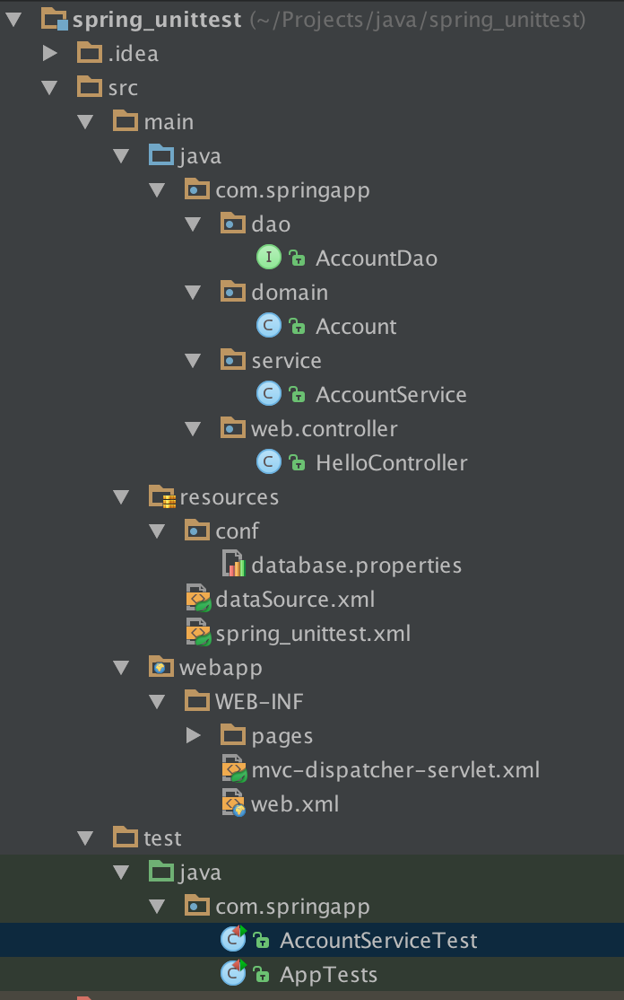

Title: Spring中进行单元测试
Date: 2015-6-28
Modified: 2014-6-28
Category: java
Tags: java, spring, unit test
Slug: spring_unittest
Author: bigpotato

##Spring中进行单元测试和集成测试
最近在学习利用spring mvc编写java web项目，以前在学习java时使用junit进行单元测试，但由于spring应用中要进行依赖注入，所以spring应用中不能直接利用junit进行单元测试。通过万能的google发现利用spring-test、junit4和Mockito可以方便的在spring项目中进行单元测试。下面对这两个框架分别进行介绍。

###spring-test
>spring-test 是spring提供的一个单元测试框架，spring-test可以帮助我们自动加载spring的配置文件，依赖注入，自动对数据库操作进行回滚。

下面是一个利用spring-test和junit4在spring中进行单元测试的例子：
项目的目录结构如下：
 
 
 在这个spring项目中，除了MVC层，还包含业务层和数据访问层，业务层有一个类AccountService，负责账号处理类的业务，它依赖于数据访问层AccountDao，这个类提供了对数据库的增删改查的方法。AccountService类中通过自动注入的方式来获得AccountDao的实例。各个类的实现如下：
 
Account.java
 
```java
 package com.springapp.domain;

/**
 * Created by hjy on 6/28/15.
 */
public class Account {
    private long id;
    private String name;
    private String password;

    public long getId() {
        return id;
    }

    public void setId(long id) {
        this.id = id;
    }

    public String getName() {
        return name;
    }

    public void setName(String name) {
        this.name = name;
    }

    public String getPassword() {
        return password;
    }

    public void setPassword(String password) {
        this.password = password;
    }

    @Override
    public String toString() {
        return "Account{" +
                "id=" + id +
                ", name='" + name + '\'' +
                ", password='" + password + '\'' +
                '}';
    }
```
 
 AccountDao.java
 
```java
package com.springapp.dao;

import com.springapp.domain.Account;
import org.apache.ibatis.annotations.Select;
import org.springframework.stereotype.Component;

/**
 * Created by hjy on 6/28/15.
 */
@Component
public interface AccountDao {
    public static final String TABLENAME = "account";
    public static final String VIEW = "id, name, password";

    @Select("select " + VIEW + " from " + TABLENAME + " where id = #{id}")
    public Account selectById(long id);

}
```

AccountService.java

```java
package com.springapp.service;

import com.springapp.dao.AccountDao;
import com.springapp.domain.Account;
import org.springframework.beans.factory.annotation.Autowired;
import org.springframework.stereotype.Service;

/**
 * Created by hjy on 6/28/15.
 */
@Service
public class AccountService {
    @Autowired
    AccountDao accountDao;

    public Account getById(long id) {
        return accountDao.selectById(id);
    }
}

```

AccountServiceTest.java

```java
package com.springapp;

import com.springapp.domain.Account;
import com.springapp.service.AccountService;
import org.junit.Test;
import org.junit.runner.RunWith;
import org.springframework.beans.factory.annotation.Autowired;
import org.springframework.test.context.ContextConfiguration;
import org.springframework.test.context.junit4.SpringJUnit4ClassRunner;

import static org.junit.Assert.assertNotNull;

/**
 * Created by hjy on 6/28/15.
 */

@RunWith(SpringJUnit4ClassRunner.class)
@ContextConfiguration(locations = {"/spring_unittest.xml"})
@Transactional
public class AccountServiceTest {
    @Autowired
    AccountService accountService;

    @Test
    public void testSelectById() {
        Account account = accountService.getById(1);
        assertNotNull(account);
        System.out.println(account);
    }
}
```
对单元测试的这个类解释一下

- @RunWith是Junit 提供的注解，用来说明此测试类的运行者，这里用了 SpringJUnit4ClassRunner，这个类是一个针对 Junit 运行环境的自定义扩展，用来标准化在 Spring 环境中 Junit4.5 的测试用例，例如支持的注释标签的标准化
- @ContextConfiguration Spring test context 提供的注解，用来指定 Spring 配置信息的来源，支持指定 XML 文件位置或者 Spring 配置类名，这里我们指定 classpath 下的 spring_unittest.xml 为配置文件的位置。
- @Transactional 注释标签是表明此测试类的事务启用，这样所有的测试方案都会自动的 rollback，即您不用自己清除自己所做的任何对数据库的变更了
- @Autowired是spring中自动注入的注解